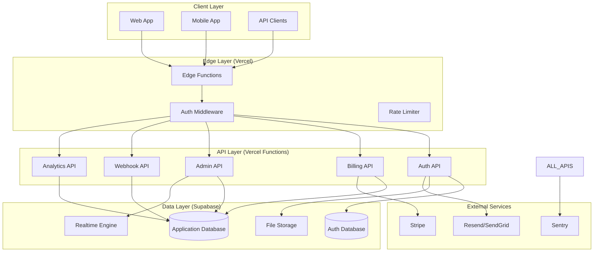
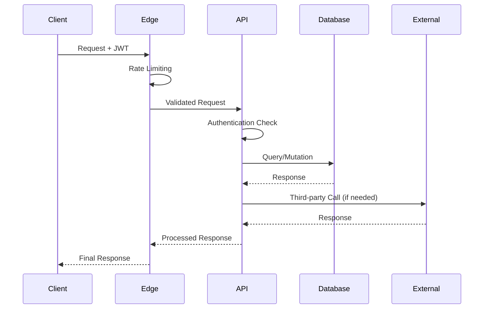

# Orchestrator App - Backend Architecture Document

## 1. System Overview

### Architecture Diagram



### Data Flow Architecture



## 2. Technology Stack

### Core Infrastructure
- **Hosting**: Vercel (Functions + Edge Runtime)
- **Database**: Supabase (PostgreSQL + Auth + Storage + Realtime)
- **Runtime**: Node.js 18+ with TypeScript
- **Framework**: Next.js 14 (API Routes + Edge Functions)

### Supporting Technologies
- **Authentication**: Supabase Auth + Custom JWT handling
- **Payments**: Stripe (API + Webhooks)
- **Email**: Resend (free tier: 3k emails/month)
- **Monitoring**: Sentry (free tier: 5k errors/month)
- **Validation**: Zod for schema validation
- **Caching**: Vercel Edge Cache + Redis (Upstash free tier)

### Technology Rationale

| Technology | Rationale | Free Tier Limits |
|------------|-----------|------------------|
| Vercel | Serverless functions, global edge network, zero config deployment | 100GB bandwidth, 12 functions |
| Supabase | Managed PostgreSQL, built-in auth, real-time subscriptions | 50k requests/month, 500MB DB |
| Next.js | Full-stack framework, API routes, edge runtime support | N/A |
| Stripe | Industry standard, robust webhook system, extensive docs | No limits on free plan |
| Resend | Modern email API, good deliverability, generous free tier | 3,000 emails/month |

## 3. API Design

### RESTful Endpoints Structure

```
/api/v1/
├── auth/
│   ├── POST /signup
│   ├── POST /signin
│   ├── POST /signout
│   ├── POST /refresh
│   ├── POST /forgot-password
│   └── POST /reset-password
├── user/
│   ├── GET /profile
│   ├── PUT /profile
│   └── DELETE /account
├── billing/
│   ├── GET /subscription
│   ├── POST /subscription
│   ├── PUT /subscription
│   ├── POST /payment-method
│   └── GET /invoices
├── admin/
│   ├── GET /users
│   ├── GET /users/:id
│   ├── PUT /users/:id
│   ├── GET /analytics
│   └── GET /system-health
└── webhooks/
    ├── POST /stripe
    └── POST /supabase
```

### API Contracts

#### Authentication Endpoints

```typescript
// POST /api/v1/auth/signup
interface SignupRequest {
  email: string;
  password: string;
  firstName: string;
  lastName: string;
  organizationName?: string;
}

interface SignupResponse {
  success: boolean;
  user: {
    id: string;
    email: string;
    firstName: string;
    lastName: string;
    emailVerified: boolean;
  };
  accessToken: string;
  refreshToken: string;
}

// POST /api/v1/auth/signin
interface SigninRequest {
  email: string;
  password: string;
}

interface SigninResponse {
  success: boolean;
  user: UserProfile;
  accessToken: string;
  refreshToken: string;
}
```

#### Billing Endpoints

```typescript
// GET /api/v1/billing/subscription
interface SubscriptionResponse {
  id: string;
  status: 'active' | 'canceled' | 'past_due' | 'unpaid';
  planId: string;
  planName: string;
  currentPeriodStart: string;
  currentPeriodEnd: string;
  cancelAtPeriodEnd: boolean;
  usage: {
    requests: number;
    storage: number;
    users: number;
  };
  limits: {
    requests: number;
    storage: number;
    users: number;
  };
}

// POST /api/v1/billing/subscription
interface CreateSubscriptionRequest {
  planId: string;
  paymentMethodId: string;
}
```

#### Admin Endpoints

```typescript
// GET /api/v1/admin/users
interface GetUsersRequest {
  page?: number;
  limit?: number;
  search?: string;
  status?: 'active' | 'inactive' | 'suspended';
  sortBy?: 'created_at' | 'last_sign_in' | 'email';
  sortOrder?: 'asc' | 'desc';
}

interface GetUsersResponse {
  users: UserProfile[];
  pagination: {
    page: number;
    limit: number;
    total: number;
    totalPages: number;
  };
}
```

### HTTP Status Codes & Error Responses

```typescript
interface ErrorResponse {
  success: false;
  error: {
    code: string;
    message: string;
    details?: Record<string, any>;
  };
  timestamp: string;
  requestId: string;
}

// Standard HTTP Status Codes
// 200 - Success
// 201 - Created
// 400 - Bad Request (validation errors)
// 401 - Unauthorized (invalid/missing token)
// 403 - Forbidden (insufficient permissions)
// 404 - Not Found
// 409 - Conflict (duplicate resource)
// 422 - Unprocessable Entity (business logic error)
// 429 - Too Many Requests (rate limit exceeded)
// 500 - Internal Server Error
```

## 4. Authentication & Authorization

### JWT Token Strategy

```typescript
interface JWTPayload {
  sub: string; // user ID
  email: string;
  role: 'user' | 'admin' | 'super_admin';
  organizationId: string;
  permissions: string[];
  iat: number;
  exp: number;
}

// Token Configuration
const TOKEN_CONFIG = {
  accessToken: {
    expiresIn: '15m',
    algorithm: 'HS256'
  },
  refreshToken: {
    expiresIn: '7d',
    algorithm: 'HS256'
  }
};
```

### Role-Based Access Control (RBAC)

```typescript
enum Role {
  USER = 'user',
  ADMIN = 'admin',
  SUPER_ADMIN = 'super_admin'
}

enum Permission {
  // User permissions
  READ_PROFILE = 'read:profile',
  UPDATE_PROFILE = 'update:profile',
  DELETE_ACCOUNT = 'delete:account',
  
  // Billing permissions
  READ_BILLING = 'read:billing',
  MANAGE_BILLING = 'manage:billing',
  
  // Admin permissions
  READ_USERS = 'read:users',
  MANAGE_USERS = 'manage:users',
  READ_ANALYTICS = 'read:analytics',
  SYSTEM_ADMIN = 'system:admin'
}

const ROLE_PERMISSIONS: Record<Role, Permission[]> = {
  [Role.USER]: [
    Permission.READ_PROFILE,
    Permission.UPDATE_PROFILE,
    Permission.DELETE_ACCOUNT,
    Permission.READ_BILLING,
    Permission.MANAGE_BILLING
  ],
  [Role.ADMIN]: [
    ...ROLE_PERMISSIONS[Role.USER],
    Permission.READ_USERS,
    Permission.MANAGE_USERS,
    Permission.READ_ANALYTICS
  ],
  [Role.SUPER_ADMIN]: [
    ...ROLE_PERMISSIONS[Role.ADMIN],
    Permission.SYSTEM_ADMIN
  ]
};
```

### Authentication Middleware

```typescript
// Edge middleware for authentication
export async function authMiddleware(request: Request) {
  const token = extractToken(request);
  
  if (!token) {
    return new Response('Unauthorized', { status: 401 });
  }

  try {
    const payload = await verifyJWT(token);
    
    // Add user context to request
    request.headers.set('x-user-id', payload.sub);
    request.headers.set('x-user-role', payload.role);
    request.headers.set('x-organization-id', payload.organizationId);
    
    return NextResponse.next();
  } catch (error) {
    return new Response('Invalid token', { status: 401 });
  }
}

// Permission checking utility
export function requirePermissions(...permissions: Permission[]) {
  return async (request: Request) => {
    const userRole = request.headers.get('x-user-role') as Role;
    const userPermissions = ROLE_PERMISSIONS[userRole];
    
    const hasPermission = permissions.every(permission =>
      userPermissions.includes(permission)
    );
    
    if (!hasPermission) {
      throw new ForbiddenError('Insufficient permissions');
    }
  };
}
```

## 5. Database Design Considerations

### Supabase Configuration

```sql
-- Enable Row Level Security
ALTER DATABASE postgres SET row_security = on;

-- Enable real-time for specific tables
ALTER PUBLICATION supabase_realtime ADD TABLE users;
ALTER PUBLICATION supabase_realtime ADD TABLE organizations;
ALTER PUBLICATION supabase_realtime ADD TABLE analytics_events;
```

### Key Database Patterns

#### Multi-tenancy Strategy
```typescript
// Organization-based multi-tenancy
interface DatabaseEntity {
  id: string;
  organizationId: string; // Tenant isolation
  createdAt: Date;
  updatedAt: Date;
}

// RLS Policy Example
CREATE POLICY "Users can only access their organization data" 
ON users FOR ALL 
USING (organization_id = auth.jwt() ->> 'organization_id');
```

#### Audit Trail Pattern
```typescript
interface AuditLog {
  id: string;
  entityType: string;
  entityId: string;
  action: 'CREATE' | 'UPDATE' | 'DELETE';
  changes: Record<string, any>;
  userId: string;
  organizationId: string;
  timestamp: Date;
  ipAddress?: string;
  userAgent?: string;
}
```

### Data Optimization for Free Tier

```typescript
// Database optimization strategies
const DB_OPTIMIZATION = {
  // Use JSONB for flexible schemas to reduce table count
  userPreferences: 'JSONB',
  organizationSettings: 'JSONB',
  
  // Implement soft deletes to maintain referential integrity
  deletedAt: 'TIMESTAMP NULL',
  
  // Use efficient indexing
  indexes: [
    'CREATE INDEX idx_users_organization_id ON users(organization_id)',
    'CREATE INDEX idx_users_email_organization ON users(email, organization_id)',
    'CREATE INDEX idx_audit_logs_entity ON audit_logs(entity_type, entity_id)'
  ],
  
  // Implement data archiving for old records
  archivalPolicy: {
    auditLogs: '90 days',
    analyticsEvents: '180 days'
  }
};
```

## 6. Security Measures

### Input Validation & Sanitization

```typescript
import { z } from 'zod';

// Request validation schemas
const signupSchema = z.object({
  email: z.string().email().max(255),
  password: z.string().min(8).max(128).regex(/^(?=.*[a-z])(?=.*[A-Z])(?=.*\d)(?=.*[@$!%*?&])/),
  firstName: z.string().min(1).max(50).regex(/^[a-zA-Z\s-']+$/),
  lastName: z.string().min(1).max(50).regex(/^[a-zA-Z\s-']+$/),
  organizationName: z.string().max(100).optional()
});

// Sanitization middleware
export function sanitizeInput(schema: z.ZodSchema) {
  return async (request: Request) => {
    const body = await request.json();
    
    try {
      const sanitized = schema.parse(body);
      return sanitized;
    } catch (error) {
      throw new ValidationError('Invalid input', error.errors);
    }
  };
}
```

### Security Headers & CORS

```typescript
// Security headers configuration
export const SECURITY_HEADERS = {
  'X-Content-Type-Options': 'nosniff',
  'X-Frame-Options': 'DENY',
  'X-XSS-Protection': '1; mode=block',
  'Referrer-Policy': 'strict-origin-when-cross-origin',
  'Content-Security-Policy': "default-src 'self'; script-src 'self' 'unsafe-inline'; style-src 'self' 'unsafe-inline'",
  'Strict-Transport-Security': 'max-age=31536000; includeSubDomains'
};

// CORS configuration
export const CORS_CONFIG = {
  origin: process.env.NODE_ENV === 'production' 
    ? ['https://orchestrator.app', 'https://admin.orchestrator.app']
    : ['http://localhost:3000', 'http://localhost:3001'],
  methods: ['GET', 'POST', 'PUT', 'DELETE', 'OPTIONS'],
  allowedHeaders: ['Content-Type', 'Authorization', 'X-Requested-With'],
  credentials: true
};
```

### Data Encryption & Protection

```typescript
// Encryption utilities
import { createCipher, createDecipher } from 'crypto';

export class EncryptionService {
  private readonly algorithm = 'aes-256-gcm';
  private readonly key = process.env.ENCRYPTION_KEY!;

  encrypt(data: string): { encrypted: string; iv: string; tag: string } {
    const iv = crypto.randomBytes(16);
    const cipher = crypto.createCipher(this.algorithm, this.key);
    cipher.setAAD(Buffer.from('orchestrator-app'));
    
    let encrypted = cipher.update(data, 'utf8', 'hex');
    encrypted += cipher.final('hex');
    
    return {
      encrypted,
      iv: iv.toString('hex'),
      tag: cipher.getAuthTag().toString('hex')
    };
  }

  decrypt(encrypted: string, iv: string, tag: string): string {
    const decipher = crypto.createDecipher(this.algorithm, this.key);
    decipher.setAuthTag(Buffer.from(tag, 'hex'));
    decipher.setAAD(Buffer.from('orchestrator-app'));
    
    let decrypted = decipher.update(encrypted, 'hex', 'utf8');
    decrypted += decipher.final('utf8');
    
    return decrypted;
  }
}

// PII encryption for database storage
export function encryptPII(data: Record<string, any>): Record<string, any> {
  const encryptionService = new EncryptionService();
  const piiFields = ['ssn', 'creditCardNumber', 'bankAccount'];
  
  const encrypted = { ...data };
  
  piiFields.forEach(field => {
    if (encrypted[field]) {
      encrypted[field] = encryptionService.encrypt(encrypted[field]);
    }
  });
  
  return encrypted;
}
```

## 7. Performance & Scaling Strategies

### Caching Strategy

```typescript
// Multi-layer caching approach
export class CacheManager {
  private redis = new Redis(process.env.REDIS_URL);
  
  // Edge cache for static data (24h)
  async cacheAtEdge(key: string, data: any, ttl: number = 86400) {
    const response = new Response(JSON.stringify(data), {
      headers: {
        'Cache-Control': `public, max-age=${ttl}`,
        'CDN-Cache-Control': `public, max-age=${ttl}`,
        'Vercel-CDN-Cache-Control': `public, max-age=${ttl}`
      }
    });
    return response;
  }
  
  // Redis cache for dynamic data (1h)
  async set(key: string, data: any, ttl: number = 3600) {
    await this.redis.setex(key, ttl, JSON.stringify(data));
  }
  
  async get(key: string) {
    const cached = await this.redis.get(key);
    return cached ? JSON.parse(cached) : null;
  }
  
  // Cache invalidation patterns
  async invalidatePattern(pattern: string) {
    const keys = await this.redis.keys(pattern);
    if (keys.length > 0) {
      await this.redis.del(...keys);
    }
  }
}

// Cache key patterns
export const CACHE_KEYS = {
  user: (id: string) => `user:${id}`,
  userProfile: (id: string) => `profile:${id}`,
  subscription: (orgId: string) => `subscription:${orgId}`,
  analytics: (orgId: string, period: string) => `analytics:${orgId}:${period}`
};
```

### Database Query Optimization

```typescript
// Query optimization patterns
export class OptimizedQueries {
  // Use connection pooling
  private supabase = createClient(
    process.env.SUPABASE_URL!,
    process.env.SUPABASE_SERVICE_KEY!,
    {
      db: {
        pooling: true,
        pool: {
          min: 1,
          max: 10,
          idleTimeoutMillis: 30000
        }
      }
    }
  );
  
  // Efficient pagination with cursor-based approach
  async getPaginatedUsers(
    organizationId: string,
    cursor?: string,