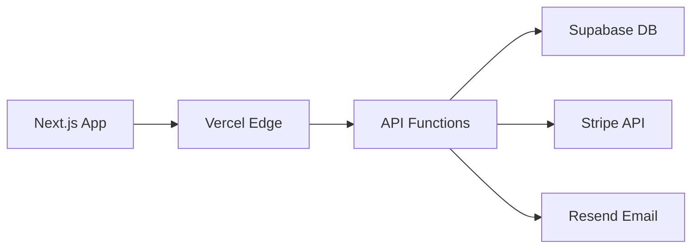

# Planning Validation Report

## 🔍 Consistency Check Results

### ✅ Aligned Items
- **Authentication Flow**: PRD user stories align with API endpoints (`/api/v1/auth/*`) and database schema (`users`, `user_sessions` tables)
- **Multi-tenancy**: Organization-based isolation consistent across all documents
- **Role-based Access**: RBAC system properly defined in architecture and reflected in UI components
- **Billing Integration**: Stripe integration flows match between PRD, API design, and database schema
- **Technology Stack**: Consistent choice of Next.js, Supabase, Vercel across all documents

### ⚠️ Warnings & Minor Inconsistencies
1. **Terminology Variance**: 
   - PRD uses "teams" while other docs use "organizations" 
   - Some endpoints use camelCase while schema uses snake_case

2. **Free Tier Limits**: 
   - Discovery mentions "free-tier optimization" but specific limits vary between docs
   - Architecture doc shows 50k requests/month for Supabase, but PRD suggests higher usage

3. **Admin Panel Scope**:
   - UI specs show detailed admin components but PRD admin user stories are high-level
   - Missing specific admin workflows in PRD

### ❌ Conflicts Found
1. **User Registration Flow**:
   - PRD mentions "organization setup" during onboarding
   - Architecture shows users belong to organizations but doesn't define org creation flow
   - Database schema has organizations table but no creation endpoint in API design

2. **Analytics Implementation**:
   - PRD requires "usage analytics" and "time-to-launch comparisons"
   - Database has analytics_events table
   - But API design missing analytics aggregation endpoints
   - UI specs show analytics components without data source specification

## 🔍 Gap Analysis

### Missing Requirements
1. **Organization Management**:
   - No API endpoints for creating/updating organizations
   - Missing organization invitation/member management flows
   - No UI specifications for organization setup

2. **Email System Integration**:
   - Architecture mentions Resend for emails
   - No API endpoints for email templates or sending
   - Missing email verification and notification flows

3. **File Upload/Storage**:
   - Database schema and architecture mention Supabase storage
   - No API endpoints for file operations
   - Missing UI components for file uploads (avatars, documents)

4. **Real-time Features**:
   - Architecture mentions Supabase real-time
   - No specification of what data should be real-time
   - Missing WebSocket connection management in UI

5. **Rate Limiting & Usage Tracking**:
   - Architecture mentions rate limiting
   - No API endpoints for usage metrics
   - Missing quota enforcement logic

### Undefined Behaviors
1. **Organization Creation**: When and how are organizations created?
2. **User Invitation**: How do users join existing organizations?
3. **Data Migration**: How to handle schema changes in production?
4. **Error Handling**: Consistent error response format not fully specified
5. **Session Management**: Token refresh strategy not detailed

### Integration Blind Spots
1. **Stripe Webhook Security**: Signature verification not specified
2. **Email Deliverability**: Bounce/complaint handling missing
3. **Cross-Origin Requests**: CORS configuration incomplete
4. **Database Migrations**: Version control and deployment strategy missing

## ⚠️ Risk Assessment

### Technical Risks (High)
1. **Database Free Tier Limits**: 50k requests/month may be insufficient for multi-user apps
2. **Cold Start Latency**: Vercel functions may have latency issues for real-time features
3. **Supabase RLS Complexity**: Row-level security policies may become complex with RBAC
4. **State Management**: No offline support specified, potential data loss

### Timeline Risks (Medium)
1. **Authentication Complexity**: Custom JWT + Supabase auth integration may take longer
2. **Admin Panel Scope**: Extensive admin features not fully scoped in PRD
3. **Real-time Features**: WebSocket implementation adds complexity
4. **Stripe Integration**: Webhook handling and edge cases need thorough testing

### Dependency Risks (Medium)
1. **Supabase Vendor Lock-in**: Heavy reliance on Supabase-specific features
2. **Vercel Function Limits**: 12 function limit may be restrictive
3. **Free Tier Dependencies**: Multiple services with usage limits create scaling bottlenecks

## 📋 Recommendations

### Immediate Actions Required
1. **Define Organization Management APIs** and UI flows
2. **Specify Analytics Data Collection** and aggregation endpoints  
3. **Add Email Service Integration** to API design
4. **Clarify User Onboarding Flow** across all documents
5. **Standardize Terminology** (use "organizations" consistently)

### Architecture Improvements
1. **Add API Versioning Strategy** to handle future changes
2. **Define Error Response Standards** across all endpoints
3. **Specify Real-time Data Requirements** and WebSocket usage
4. **Add Database Migration Strategy** for schema evolution

### Development Phase Priorities
1. **Phase 1**: Authentication + basic organization setup
2. **Phase 2**: User management + billing integration  
3. **Phase 3**: Analytics + admin panel
4. **Phase 4**: Real-time features + advanced admin tools

---

# CLAUDE.md - Orchestrator App Development Guide

## 🎯 Project Overview

**Orchestrator** is an integrated SaaS infrastructure platform designed for bootstrap founders and small development teams. It provides production-ready authentication, billing, user management, and admin panels to eliminate 40-60% of typical SaaS development overhead.

### Target Users
- **Bootstrap Founders**: Solo entrepreneurs building B2B SaaS (0-6 month MVP phase)
- **Agency Technical Leads**: Managing 3-5 client SaaS projects annually
- **Corporate Innovation Teams**: Rapid internal tool development

### Success Metrics
- 70% reduction in infrastructure development time
- <30 minutes time-to-first-value (auth + billing setup)
- <5% monthly churn rate for paid users
- $10K MRR by month 12

## 🏗️ Architecture Summary

### Technology Stack
```
Frontend:  Next.js 14 + Tailwind CSS + Headless UI
Backend:   Vercel Functions + Edge Runtime
Database:  Supabase (PostgreSQL + Auth + Storage + Realtime)
Payments:  Stripe (API + Webhooks)
Email:     Resend (3k emails/month free)
Monitoring: Sentry (5k errors/month free)
```

### Core Infrastructure


### Data Model Core Entities
- **Organizations**: Multi-tenant isolation root
- **Users**: Authentication + RBAC (user/admin/super_admin)
- **Subscriptions**: Stripe billing integration
- **Analytics Events**: Usage tracking
- **Audit Logs**: Security compliance

## 🎯 MVP Scope Definition

### Phase 1: Authentication & Organizations (Weeks 1-2)
**User Stories Included:**
- US001: User Registration with email verification
- US002: Secure login with JWT tokens
- US003: Password reset functionality
- US004: Organization creation during signup
- US005: Basic profile management

**Technical Implementation:**
```typescript
// Core auth endpoints
POST /api/v1/auth/signup
POST /api/v1/auth/signin  
POST /api/v1/auth/refresh
POST /api/v1/auth/forgot-password
POST /api/v1/auth/reset-password

// Organization setup
POST /api/v1/organizations
GET /api/v1/organizations/current
```

### Phase 2: User Management & Billing (Weeks 3-4)
**User Stories Included:**
- US006: User invitation system
- US007: Role-based permissions
- US008: Stripe subscription setup
- US009: Payment method management
- US010: Usage tracking basics

### Phase 3: Admin Panel & Analytics (Weeks 5-6)
**User Stories Included:**
- US011: User management interface
- US012: Usage analytics dashboard
- US013: Subscription management
- US014: Basic audit logging

## 🛠️ Development Workflow

### Session Structure
Each development session should follow this pattern:

1. **Context Loading** (5 min)
   - Review current branch and recent commits
   - Check open issues/PRs
   - Verify development environment

2. **Feature Development** (45-50 min)
   - Implement single user story or component
   - Write tests alongside code
   - Update documentation

3. **Session Wrap-up** (5 min)
   - Commit changes with clear messages
   - Update progress tracking
   - Note any blockers or decisions needed

### Code Organization
```
src/
├── app/                 # Next.js App Router
│   ├── (auth)/         # Authentication pages
│   ├── (dashboard)/    # Main application
│   └── api/v1/         # API routes
├── components/
│   ├── ui/             # Reusable UI components
│   ├── forms/          # Form components
│   ├── layout/         # Layout components
│   └── features/       # Feature-specific components
├── lib/
│   ├── auth.ts         # Authentication utilities
│   ├── db.ts           # Database client
│   ├── stripe.ts       # Stripe integration
│   └── validations.ts  # Zod schemas
└── types/              # TypeScript definitions
```

### Development Standards

#### API Development
```typescript
// Standard API response format
interface APIResponse<T = any> {
  success: boolean;
  data?: T;
  error?: {
    code: string;
    message: string;
    details?: Record<string, any>;
  };
  timestamp: string;
  requestId: string;
}

// Error handling pattern
export async function handleAPIError(error: unknown): Promise<Response> {
  if (error instanceof ValidationError) {
    return NextResponse.json({
      success: false,
      error: {
        code: 'VALIDATION_ERROR',
        message: error.message,
        details: error.fieldErrors
      },
      timestamp: new Date().toISOString(),
      requestId: generateRequestId()
    }, { status: 400 });
  }
  
  // Handle other error types...
}
```

#### Component Development
```typescript
// Component structure template
interface ComponentProps {
  // Define props with JSDoc
}

/**
 * Brief component description
 * @param props - Component props
 * @returns JSX element
 */
export const Component: React.FC<ComponentProps> = ({ 
  // Destructure props
}) => {
  // Hooks
  // State
  // Effects
  // Event handlers
  // Render logic
  
  return (
    // JSX with proper accessibility
  );
};
```

#### Database Operations
```typescript
// Use typed database operations
interface CreateUserParams {
  organizationId: string;
  email: string;
  firstName: string;
  lastName: string;
  role: UserRole;
}

export async function createUser(params: CreateUserParams): Promise<User> {
  const { data, error } = await supabase
    .from('users')
    .insert(params)
    .select()
    .single();
    
  if (error) throw new DatabaseError('Failed to create user', error);
  return data;
}
```

## 🔧 Key Implementation Notes

### Authentication Flow
```typescript
// JWT token structure
interface JWTPayload {
  sub: string;           // user ID
  email: string;
  role: UserRole;
  organizationId: string;
  permissions: string[];
  iat: number;
  exp: number;
}

// Middleware for protected routes
export async function authMiddleware(request: Request) {
  const token = extractToken(request);
  if (!token) return unauthorized();
  
  const payload = await verifyJWT(token);
  // Add user context to request headers
  request.headers.set('x-user-id', payload.sub);
  request.headers.set('x-organization-id', payload.organizationId);
  
  return NextResponse.next();
}
```

### Multi-tenancy Pattern
```sql
-- All tables include organization_id for tenant isolation
-- RLS policies enforce organization-level access
CREATE POLICY "Users can only access their organization data" 
ON users FOR ALL 
USING (organization_id = auth.jwt() ->> 'organization_id');
```

### Billing Integration
```typescript
// Stripe webhook handling
export async function handleStripeWebhook(request: Request) {
  const signature = request.headers.get('stripe-signature');
  const payload = await request.text();
  
  const event = stripe.webhooks.constructEvent(
    payload, 
    signature!, 
    process.env.STRIPE_WEBHOOK_SECRET!
  );
  
  switch (event.type) {
    case 'customer.subscription.created':
      await handleSubscriptionCreated(event.data.object);
      break;
    // Handle other events...
  }
}
```

## 📚 Reference Documents

- **Discovery Document**: Problem definition, user personas, success metrics
- **Product Requirements**: Detailed user stories and acceptance criteria  
- **Architecture Document**: Technical implementation, API design, security
- **Database Schema**: Complete data model with relationships and constraints
- **UI Specifications**: Component library, layouts, user flows

## 🚨 Critical Decisions Needed

1. **Organization Creation Flow**: When/how organizations are created during signup
2. **Real-time Features**: Which data should be real-time vs polling
3. **Email Templates**: Standardize email design and content
4. **Error Handling**: Consistent error UI patterns across application
5. **File Upload Strategy**: Avatar/document upload implementation

## 🎯 Success Criteria for MVP

- [ ] User can sign up and verify email in <2 minutes
- [ ] Organization setup completed during onboarding
- [ ] Stripe subscription flow works end-to-end
- [ ] Admin can invite/manage users with proper permissions
- [ ] Basic usage analytics visible in dashboard
- [ ] All free-tier limits respected (Supabase, Vercel, Stripe)

---

*This document should be referenced at the start of each development session to maintain context and consistency.*