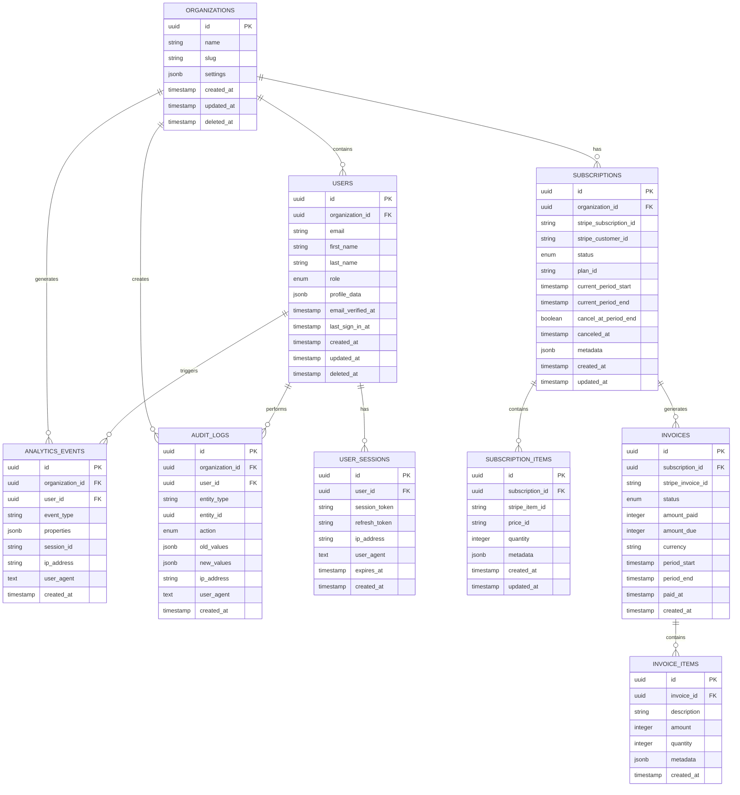

# Orchestrator App - Database Schema Design

## 1. Data Model Overview

### Entity Relationship Diagram



### Core Domain Entities

| Entity | Purpose | Key Relationships |
|--------|---------|-------------------|
| Organizations | Multi-tenant isolation | Root entity for all data |
| Users | Authentication & authorization | Belongs to organization |
| Subscriptions | Billing management | Links to Stripe, belongs to org |
| Analytics Events | Usage tracking | User actions within org |
| Audit Logs | Security & compliance | All entity changes |

## 2. Table Definitions

### Organizations Table

```sql
CREATE TABLE organizations (
    id UUID PRIMARY KEY DEFAULT gen_random_uuid(),
    name VARCHAR(100) NOT NULL,
    slug VARCHAR(50) UNIQUE NOT NULL,
    domain VARCHAR(255),
    logo_url TEXT,
    settings JSONB NOT NULL DEFAULT '{}',
    plan_limits JSONB NOT NULL DEFAULT '{
        "users": 5,
        "storage_mb": 100,
        "api_requests": 1000
    }',
    usage_stats JSONB NOT NULL DEFAULT '{
        "users": 0,
        "storage_mb": 0,
        "api_requests": 0
    }',
    created_at TIMESTAMPTZ NOT NULL DEFAULT NOW(),
    updated_at TIMESTAMPTZ NOT NULL DEFAULT NOW(),
    deleted_at TIMESTAMPTZ,
    
    CONSTRAINT organizations_name_check CHECK (length(name) >= 2),
    CONSTRAINT organizations_slug_check CHECK (slug ~ '^[a-z0-9-]+$'),
    CONSTRAINT organizations_settings_check CHECK (jsonb_typeof(settings) = 'object'),
    CONSTRAINT organizations_plan_limits_check CHECK (jsonb_typeof(plan_limits) = 'object'),
    CONSTRAINT organizations_usage_stats_check CHECK (jsonb_typeof(usage_stats) = 'object')
);

-- Indexes
CREATE INDEX idx_organizations_slug ON organizations(slug) WHERE deleted_at IS NULL;
CREATE INDEX idx_organizations_domain ON organizations(domain) WHERE deleted_at IS NULL;
CREATE INDEX idx_organizations_created_at ON organizations(created_at);
```

### Users Table

```sql
CREATE TYPE user_role AS ENUM ('user', 'admin', 'super_admin');
CREATE TYPE user_status AS ENUM ('active', 'inactive', 'suspended', 'pending_verification');

CREATE TABLE users (
    id UUID PRIMARY KEY DEFAULT gen_random_uuid(),
    organization_id UUID NOT NULL REFERENCES organizations(id) ON DELETE CASCADE,
    email VARCHAR(255) NOT NULL,
    first_name VARCHAR(50) NOT NULL,
    last_name VARCHAR(50) NOT NULL,
    role user_role NOT NULL DEFAULT 'user',
    status user_status NOT NULL DEFAULT 'pending_verification',
    avatar_url TEXT,
    phone VARCHAR(20),
    timezone VARCHAR(50) DEFAULT 'UTC',
    locale VARCHAR(10) DEFAULT 'en',
    profile_data JSONB NOT NULL DEFAULT '{}',
    preferences JSONB NOT NULL DEFAULT '{
        "notifications": {
            "email": true,
            "push": true,
            "sms": false
        },
        "theme": "system"
    }',
    email_verified_at TIMESTAMPTZ,
    last_sign_in_at TIMESTAMPTZ,
    last_sign_in_ip INET,
    sign_in_count INTEGER NOT NULL DEFAULT 0,
    failed_sign_in_count INTEGER NOT NULL DEFAULT 0,
    locked_until TIMESTAMPTZ,
    created_at TIMESTAMPTZ NOT NULL DEFAULT NOW(),
    updated_at TIMESTAMPTZ NOT NULL DEFAULT NOW(),
    deleted_at TIMESTAMPTZ,
    
    CONSTRAINT users_email_check CHECK (email ~ '^[^@]+@[^@]+\.[^@]+$'),
    CONSTRAINT users_name_check CHECK (length(first_name) >= 1 AND length(last_name) >= 1),
    CONSTRAINT users_phone_check CHECK (phone IS NULL OR phone ~ '^\+?[1-9]\d{1,14}$'),
    CONSTRAINT users_profile_data_check CHECK (jsonb_typeof(profile_data) = 'object'),
    CONSTRAINT users_preferences_check CHECK (jsonb_typeof(preferences) = 'object'),
    CONSTRAINT users_failed_attempts_check CHECK (failed_sign_in_count >= 0),
    
    UNIQUE(organization_id, email, deleted_at)
);

-- Indexes
CREATE INDEX idx_users_organization_id ON users(organization_id) WHERE deleted_at IS NULL;
CREATE INDEX idx_users_email_org ON users(email, organization_id) WHERE deleted_at IS NULL;
CREATE INDEX idx_users_role ON users(role) WHERE deleted_at IS NULL;
CREATE INDEX idx_users_status ON users(status) WHERE deleted_at IS NULL;
CREATE INDEX idx_users_last_sign_in ON users(last_sign_in_at);
CREATE INDEX idx_users_created_at ON users(created_at);
CREATE INDEX idx_users_profile_gin ON users USING gin(profile_data);
```

### User Sessions Table

```sql
CREATE TABLE user_sessions (
    id UUID PRIMARY KEY DEFAULT gen_random_uuid(),
    user_id UUID NOT NULL REFERENCES users(id) ON DELETE CASCADE,
    session_token VARCHAR(255) UNIQUE NOT NULL,
    refresh_token VARCHAR(255) UNIQUE NOT NULL,
    ip_address INET,
    user_agent TEXT,
    device_info JSONB DEFAULT '{}',
    expires_at TIMESTAMPTZ NOT NULL,
    last_accessed_at TIMESTAMPTZ NOT NULL DEFAULT NOW(),
    created_at TIMESTAMPTZ NOT NULL DEFAULT NOW(),
    
    CONSTRAINT user_sessions_expires_check CHECK (expires_at > created_at),
    CONSTRAINT user_sessions_device_info_check CHECK (jsonb_typeof(device_info) = 'object')
);

-- Indexes
CREATE INDEX idx_user_sessions_user_id ON user_sessions(user_id);
CREATE INDEX idx_user_sessions_token ON user_sessions(session_token);
CREATE INDEX idx_user_sessions_refresh_token ON user_sessions(refresh_token);
CREATE INDEX idx_user_sessions_expires_at ON user_sessions(expires_at);
CREATE INDEX idx_user_sessions_ip ON user_sessions(ip_address);
```

### Subscriptions Table

```sql
CREATE TYPE subscription_status AS ENUM (
    'incomplete', 'incomplete_expired', 'trialing', 'active', 
    'past_due', 'canceled', 'unpaid', 'paused'
);

CREATE TABLE subscriptions (
    id UUID PRIMARY KEY DEFAULT gen_random_uuid(),
    organization_id UUID NOT NULL REFERENCES organizations(id) ON DELETE CASCADE,
    stripe_subscription_id VARCHAR(255) UNIQUE NOT NULL,
    stripe_customer_id VARCHAR(255) NOT NULL,
    status subscription_status NOT NULL,
    plan_id VARCHAR(100) NOT NULL,
    plan_name VARCHAR(100) NOT NULL,
    current_period_start TIMESTAMPTZ NOT NULL,
    current_period_end TIMESTAMPTZ NOT NULL,
    trial_start TIMESTAMPTZ,
    trial_end TIMESTAMPTZ,
    cancel_at_period_end BOOLEAN NOT NULL DEFAULT false,
    canceled_at TIMESTAMPTZ,
    ended_at TIMESTAMPTZ,
    latest_invoice_id VARCHAR(255),
    default_payment_method VARCHAR(255),
    metadata JSONB NOT NULL DEFAULT '{}',
    created_at TIMESTAMPTZ NOT NULL DEFAULT NOW(),
    updated_at TIMESTAMPTZ NOT NULL DEFAULT NOW(),
    
    CONSTRAINT subscriptions_period_check CHECK (current_period_end > current_period_start),
    CONSTRAINT subscriptions_trial_check CHECK (
        (trial_start IS NULL AND trial_end IS NULL) OR 
        (trial_start IS NOT NULL AND trial_end IS NOT NULL AND trial_end > trial_start)
    ),
    CONSTRAINT subscriptions_metadata_check CHECK (jsonb_typeof(metadata) = 'object'),
    
    UNIQUE(organization_id)
);

-- Indexes
CREATE INDEX idx_subscriptions_organization_id ON subscriptions(organization_id);
CREATE INDEX idx_subscriptions_stripe_id ON subscriptions(stripe_subscription_id);
CREATE INDEX idx_subscriptions_customer_id ON subscriptions(stripe_customer_id);
CREATE INDEX idx_subscriptions_status ON subscriptions(status);
CREATE INDEX idx_subscriptions_plan ON subscriptions(plan_id);
CREATE INDEX idx_subscriptions_period_end ON subscriptions(current_period_end);
```

### Subscription Items Table

```sql
CREATE TABLE subscription_items (
    id UUID PRIMARY KEY DEFAULT gen_random_uuid(),
    subscription_id UUID NOT NULL REFERENCES subscriptions(id) ON DELETE CASCADE,
    stripe_item_id VARCHAR(255) UNIQUE NOT NULL,
    price_id VARCHAR(255) NOT NULL,
    product_id VARCHAR(255) NOT NULL,
    quantity INTEGER NOT NULL DEFAULT 1,
    unit_amount INTEGER NOT NULL,
    currency VARCHAR(3) NOT NULL DEFAULT 'usd',
    metadata JSONB NOT NULL DEFAULT '{}',
    created_at TIMESTAMPTZ NOT NULL DEFAULT NOW(),
    updated_at TIMESTAMPTZ NOT NULL DEFAULT NOW(),
    
    CONSTRAINT subscription_items_quantity_check CHECK (quantity > 0),
    CONSTRAINT subscription_items_amount_check CHECK (unit_amount >= 0),
    CONSTRAINT subscription_items_currency_check CHECK (length(currency) = 3),
    CONSTRAINT subscription_items_metadata_check CHECK (jsonb_typeof(metadata) = 'object')
);

-- Indexes
CREATE INDEX idx_subscription_items_subscription_id ON subscription_items(subscription_id);
CREATE INDEX idx_subscription_items_stripe_id ON subscription_items(stripe_item_id);
CREATE INDEX idx_subscription_items_price_id ON subscription_items(price_id);
```

### Invoices Table

```sql
CREATE TYPE invoice_status AS ENUM ('draft', 'open', 'paid', 'void', 'uncollectible');

CREATE TABLE invoices (
    id UUID PRIMARY KEY DEFAULT gen_random_uuid(),
    subscription_id UUID REFERENCES subscriptions(id) ON DELETE SET NULL,
    organization_id UUID NOT NULL REFERENCES organizations(id) ON DELETE CASCADE,
    stripe_invoice_id VARCHAR(255) UNIQUE NOT NULL,
    invoice_number VARCHAR(100),
    status invoice_status NOT NULL,
    amount_paid INTEGER NOT NULL DEFAULT 0,
    amount_due INTEGER NOT NULL DEFAULT 0,
    amount_remaining INTEGER NOT NULL DEFAULT 0,
    subtotal INTEGER NOT NULL DEFAULT 0,
    total INTEGER NOT NULL DEFAULT 0,
    tax_amount INTEGER NOT NULL DEFAULT 0,
    currency VARCHAR(3) NOT NULL DEFAULT 'usd',
    description TEXT,
    period_start TIMESTAMPTZ,
    period_end TIMESTAMPTZ,
    due_date TIMESTAMPTZ,
    paid_at TIMESTAMPTZ,
    voided_at TIMESTAMPTZ,
    attempt_count INTEGER NOT NULL DEFAULT 0,
    hosted_invoice_url TEXT,
    invoice_pdf_url TEXT,
    metadata JSONB NOT NULL DEFAULT '{}',
    created_at TIMESTAMPTZ NOT NULL DEFAULT NOW(),
    updated_at TIMESTAMPTZ NOT NULL DEFAULT NOW(),
    
    CONSTRAINT invoices_amounts_check CHECK (
        amount_paid >= 0 AND amount_due >= 0 AND amount_remaining >= 0 AND
        subtotal >= 0 AND total >= 0 AND tax_amount >= 0
    ),
    CONSTRAINT invoices_currency_check CHECK (length(currency) = 3),
    CONSTRAINT invoices_period_check CHECK (
        (period_start IS NULL AND period_end IS NULL) OR
        (period_start IS NOT NULL AND period_end IS NOT NULL AND period_end > period_start)
    ),
    CONSTRAINT invoices_metadata_check CHECK (jsonb_typeof(metadata) = 'object')
);

-- Indexes
CREATE INDEX idx_invoices_subscription_id ON invoices(subscription_id);
CREATE INDEX idx_invoices_organization_id ON invoices(organization_id);
CREATE INDEX idx_invoices_stripe_id ON invoices(stripe_invoice_id);
CREATE INDEX idx_invoices_status ON invoices(status);
CREATE INDEX idx_invoices_due_date ON invoices(due_date) WHERE status = 'open';
CREATE INDEX idx_invoices_period ON invoices(period_start, period_end);
CREATE INDEX idx_invoices_created_at ON invoices(created_at);
```

### Invoice Items Table

```sql
CREATE TABLE invoice_items (
    id UUID PRIMARY KEY DEFAULT gen_random_uuid(),
    invoice_id UUID NOT NULL REFERENCES invoices(id) ON DELETE CASCADE,
    stripe_item_id VARCHAR(255),
    description TEXT NOT NULL,
    amount INTEGER NOT NULL,
    currency VARCHAR(3) NOT NULL DEFAULT 'usd',
    quantity INTEGER NOT NULL DEFAULT 1,
    unit_amount INTEGER NOT NULL,
    period_start TIMESTAMPTZ,
    period_end TIMESTAMPTZ,
    proration BOOLEAN NOT NULL DEFAULT false,
    metadata JSONB NOT NULL DEFAULT '