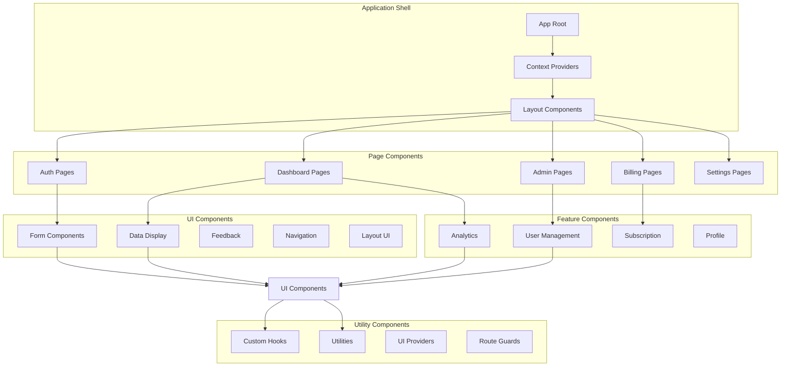
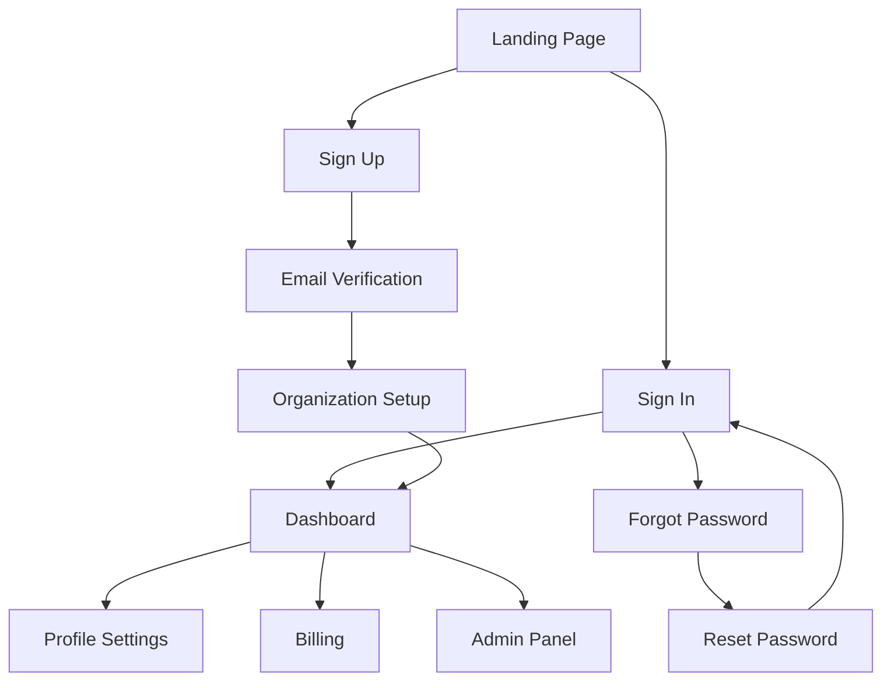
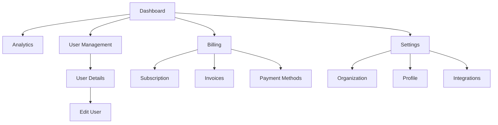

# Orchestrator App - Frontend UI Specifications

## 1. Component Architecture Overview

### Architecture Diagram



### Technology Stack

| Layer | Technology | Purpose |
|-------|------------|---------|
| Framework | Next.js 14 | App Router, SSR, API Routes |
| UI Library | Tailwind CSS + Headless UI | Utility-first styling + accessible components |
| State Management | Zustand + React Query | Client state + server state |
| Forms | React Hook Form + Zod | Form handling + validation |
| Animation | Framer Motion | Smooth transitions |
| Icons | Heroicons + Lucide React | Consistent iconography |
| Charts | Recharts | Analytics visualization |
| Date Handling | date-fns | Lightweight date utilities |

### Component Hierarchy

```typescript
// Component structure
src/
├── app/                    # Next.js App Router
│   ├── (auth)/            # Auth route group
│   ├── (dashboard)/       # Dashboard route group
│   ├── (admin)/          # Admin route group
│   └── globals.css       # Global styles
├── components/
│   ├── ui/               # Base UI components
│   ├── forms/            # Form components
│   ├── layout/           # Layout components
│   ├── features/         # Feature-specific components
│   └── providers/        # Context providers
├── hooks/                # Custom hooks
├── lib/                  # Utilities and configurations
├── stores/               # Zustand stores
└── types/                # TypeScript definitions
```

## 2. Screen Inventory & User Flows

### Authentication Flow



### Main Application Flow



### Screen Specifications

| Screen | Route | Purpose | Auth Required | Role Required |
|--------|-------|---------|---------------|---------------|
| Landing | `/` | Marketing homepage | No | None |
| Sign In | `/auth/signin` | User authentication | No | None |
| Sign Up | `/auth/signup` | User registration | No | None |
| Forgot Password | `/auth/forgot` | Password reset request | No | None |
| Reset Password | `/auth/reset` | Password reset form | No | None |
| Email Verification | `/auth/verify` | Email confirmation | No | None |
| Dashboard | `/dashboard` | Main overview | Yes | User+ |
| Analytics | `/dashboard/analytics` | Usage analytics | Yes | User+ |
| User Management | `/dashboard/users` | User list & management | Yes | Admin+ |
| User Details | `/dashboard/users/[id]` | Individual user view | Yes | Admin+ |
| Billing | `/dashboard/billing` | Subscription management | Yes | Admin+ |
| Invoices | `/dashboard/billing/invoices` | Invoice history | Yes | Admin+ |
| Organization Settings | `/dashboard/settings/organization` | Org configuration | Yes | Admin+ |
| Profile Settings | `/dashboard/settings/profile` | Personal settings | Yes | User+ |
| Admin Panel | `/admin` | System administration | Yes | Super Admin |

## 3. Component Specifications

### Base UI Components

#### Button Component

```typescript
// components/ui/Button.tsx
interface ButtonProps {
  variant: 'primary' | 'secondary' | 'outline' | 'ghost' | 'danger';
  size: 'sm' | 'md' | 'lg';
  loading?: boolean;
  disabled?: boolean;
  fullWidth?: boolean;
  leftIcon?: React.ReactNode;
  rightIcon?: React.ReactNode;
  children: React.ReactNode;
  onClick?: () => void;
  type?: 'button' | 'submit' | 'reset';
}

const Button: React.FC<ButtonProps> = ({
  variant = 'primary',
  size = 'md',
  loading = false,
  disabled = false,
  fullWidth = false,
  leftIcon,
  rightIcon,
  children,
  ...props
}) => {
  const baseClasses = 'inline-flex items-center justify-center font-medium rounded-lg transition-colors focus:outline-none focus:ring-2 focus:ring-offset-2';
  
  const variants = {
    primary: 'bg-blue-600 text-white hover:bg-blue-700 focus:ring-blue-500',
    secondary: 'bg-gray-600 text-white hover:bg-gray-700 focus:ring-gray-500',
    outline: 'border border-gray-300 text-gray-700 hover:bg-gray-50 focus:ring-blue-500',
    ghost: 'text-gray-700 hover:bg-gray-100 focus:ring-gray-500',
    danger: 'bg-red-600 text-white hover:bg-red-700 focus:ring-red-500'
  };
  
  const sizes = {
    sm: 'px-3 py-1.5 text-sm',
    md: 'px-4 py-2 text-sm',
    lg: 'px-6 py-3 text-base'
  };
  
  return (
    <button
      className={cn(
        baseClasses,
        variants[variant],
        sizes[size],
        fullWidth && 'w-full',
        (disabled || loading) && 'opacity-50 cursor-not-allowed'
      )}
      disabled={disabled || loading}
      {...props}
    >
      {loading && <Spinner className="mr-2 h-4 w-4" />}
      {leftIcon && !loading && <span className="mr-2">{leftIcon}</span>}
      {children}
      {rightIcon && <span className="ml-2">{rightIcon}</span>}
    </button>
  );
};
```

#### Input Component

```typescript
// components/ui/Input.tsx
interface InputProps extends React.InputHTMLAttributes<HTMLInputElement> {
  label?: string;
  error?: string;
  hint?: string;
  leftIcon?: React.ReactNode;
  rightIcon?: React.ReactNode;
  required?: boolean;
}

const Input: React.FC<InputProps> = ({
  label,
  error,
  hint,
  leftIcon,
  rightIcon,
  required,
  className,
  id,
  ...props
}) => {
  const inputId = id || `input-${Math.random().toString(36).substr(2, 9)}`;
  
  return (
    <div className="space-y-1">
      {label && (
        <label htmlFor={inputId} className="block text-sm font-medium text-gray-700">
          {label}
          {required && <span className="text-red-500 ml-1">*</span>}
        </label>
      )}
      
      <div className="relative">
        {leftIcon && (
          <div className="absolute inset-y-0 left-0 pl-3 flex items-center pointer-events-none">
            <span className="text-gray-400">{leftIcon}</span>
          </div>
        )}
        
        <input
          id={inputId}
          className={cn(
            'block w-full rounded-md border-gray-300 shadow-sm',
            'focus:border-blue-500 focus:ring-blue-500',
            'disabled:bg-gray-50 disabled:text-gray-500',
            leftIcon && 'pl-10',
            rightIcon && 'pr-10',
            error && 'border-red-300 focus:border-red-500 focus:ring-red-500',
            className
          )}
          {...props}
        />
        
        {rightIcon && (
          <div className="absolute inset-y-0 right-0 pr-3 flex items-center">
            <span className="text-gray-400">{rightIcon}</span>
          </div>
        )}
      </div>
      
      {error && (
        <p className="text-sm text-red-600" role="alert">
          {error}
        </p>
      )}
      
      {hint && !error && (
        <p className="text-sm text-gray-500">{hint}</p>
      )}
    </div>
  );
};
```

#### Modal Component

```typescript
// components/ui/Modal.tsx
interface ModalProps {
  isOpen: boolean;
  onClose: () => void;
  title?: string;
  size?: 'sm' | 'md' | 'lg' | 'xl';
  children: React.ReactNode;
  closeOnOverlayClick?: boolean;
  showCloseButton?: boolean;
}

const Modal: React.FC<ModalProps> = ({
  isOpen,
  onClose,
  title,
  size = 'md',
  children,
  closeOnOverlayClick = true,
  showCloseButton = true
}) => {
  const sizes = {
    sm: 'max-w-md',
    md: 'max-w-lg',
    lg: 'max-w-2xl',
    xl: 'max-w-4xl'
  };
  
  return (
    <Transition appear show={isOpen} as={Fragment}>
      <Dialog as="div" className="relative z-50" onClose={closeOnOverlayClick ? onClose : () => {}}>
        <Transition.Child
          as={Fragment}
          enter="ease-out duration-300"
          enterFrom="opacity-0"
          enterTo="opacity-100"
          leave="ease-in duration-200"
          leaveFrom="opacity-100"
          leaveTo="opacity-0"
        >
          <div className="fixed inset-0 bg-black bg-opacity-25" />
        </Transition.Child>

        <div className="fixed inset-0 overflow-y-auto">
          <div className="flex min-h-full items-center justify-center p-4">
            <Transition.Child
              as={Fragment}
              enter="ease-out duration-300"
              enterFrom="opacity-0 scale-95"
              enterTo="opacity-100 scale-100"
              leave="ease-in duration-200"
              leaveFrom="opacity-100 scale-100"
              leaveTo="opacity-0 scale-95"
            >
              <Dialog.Panel className={cn(
                'w-full transform overflow-hidden rounded-lg bg-white shadow-xl transition-all',
                sizes[size]
              )}>
                {(title || showCloseButton) && (
                  <div className="flex items-center justify-between p-6 border-b border-gray-200">
                    {title && (
                      <Dialog.Title className="text-lg font-medium text-gray-900">
                        {title}
                      </Dialog.Title>
                    )}
                    {showCloseButton && (
                      <button
                        onClick={onClose}
                        className="text-gray-400 hover:text-gray-500"
                      >
                        <XMarkIcon className="h-6 w-6" />
                      </button>
                    )}
                  </div>
                )}
                
                <div className="p-6">
                  {children}
                </div>
              </Dialog.Panel>
            </Transition.Child>
          </div>
        </div>
      </Dialog>
    </Transition>
  );
};
```

### Layout Components

#### AppLayout

```typescript
// components/layout/AppLayout.tsx
interface AppLayoutProps {
  children: React.ReactNode;
  title?: string;
  showSidebar?: boolean;
}

const AppLayout: React.FC<AppLayoutProps> = ({
  children,
  title,
  showSidebar = true
}) => {
  const [sidebarOpen, setSidebarOpen] = useState(false);
  
  return (
    <div className="min-h-screen bg-gray-50">
      {/* Mobile sidebar */}
      <MobileSidebar
        isOpen={sidebarOpen}
        onClose={() => setSidebarOpen(false)}
      />
      
      {/* Desktop sidebar */}
      {showSidebar && (
        <div className="hidden lg:fixed lg:inset-y-0 lg:flex lg:w-64 lg:flex-col">
          <Sidebar />
        </div>
      )}
      
      {/* Main content */}
      <div className={cn(
        'flex flex-col',
        showSidebar ? 'lg:pl-64' : ''
      )}>
        {/* Header */}
        <Header
          onMenuClick={() => setSidebarOpen(true)}
          showMenuButton={showSidebar}
          title={title}
        />
        
        {/* Page content */}
        <main className="flex-1">
          {children}
        </main>
      </div>
    </div>
  );
};
```

#### Sidebar Component

```typescript
// components/layout/Sidebar.tsx
const Sidebar: React.FC = () => {
  const { user } = useAuth();
  const pathname = usePathname();
  
  const navigation = [
    { name: 'Dashboard', href: '/dashboard', icon: HomeIcon },
    { name: 'Analytics', href: '/dashboard/analytics', icon: ChartBarIcon },
    { name: 'Users', href: '/dashboard/users', icon: UsersIcon, adminOnly: true },
    { name: 'Billing', href: '/dashboard/billing', icon: CreditCardIcon, adminOnly: true },
    { name: 'Settings', href: '/dashboard/settings', icon: CogIcon }
  ];
  
  const filteredNavigation = navigation.filter(item => 
    !item.adminOnly || ['admin', 'super_admin'].includes(user?.role)
  );
  
  return (
    <div className="flex flex-col h-full bg-white shadow-sm">
      {/* Logo */}
      <div className="flex items-center h-16 px-6 border-b border-gray-200">
        <Link href="/dashboard" className="flex items-center">
          <Logo className="h-8 w-auto" />
          <span className="ml-2 text-xl font-semibold">Orchestrator</span>
        </Link>
      </div>
      
      {/* Navigation */}
      <nav className="flex-1 px-3 py-4 space-y-1">
        {filteredNavigation.map((item) => {
          const isActive = pathname === item.href || pathname.startsWith(item.href + '/');
          
          return (
            <Link
              key={item.name}
              href={item.href}
              className={cn(
                'group flex items-center px-3 py-2 text-sm font-medium rounded-md transition-colors',
                isActive
                  ? 'bg-blue-50 text-blue-700'
                  : 'text-gray-600 hover:bg-gray-50 hover:text-gray-900'
              )}
            >
              <item.icon
                className={cn(
                  'mr-3 h-5 w-5',
                  isActive ? 'text-blue-500' : 'text-gray-400 group-hover:text-gray-500'
                )}
              />
              {item.name}
            </Link>
          );
        })}
      </nav>
      
      {/* User menu */}
      <div className="px-3 py-4 border-t border-gray-200">
        <UserMenu />
      </div>
    </div>
  );
};
```

### Form Components

#### FormProvider

```typescript
// components/forms/FormProvider.tsx
interface FormProviderProps<T extends FieldValues> {
  schema: z.ZodSchema<T>;
  defaultValues?: Partial<T>;
  onSubmit: (data: T) => Promise<void> | void;
  children: React.ReactNode;
  className?: string;
}

function FormProvider<T extends FieldValues>({
  schema,
  defaultValues,
  onSubmit,
  children,
  className
}: FormProviderProps<T>) {
  const methods = useForm<T>({
    resolver: zodResolver(schema),
    defaultValues: defaultValues as DefaultValues<T>
  });
  
  const handleSubmit = async (data: T) => {
    try {
      await onSubmit(data);
    } catch (error) {
      // Handle form submission errors
      if (error instanceof ValidationError) {
        error.fieldErrors.forEach(({ field, message }) => {
          methods.setError(field as Path<T>, { message });
        });
      }
    }
  };
  
  return (
    <FormProvider {...methods}>
      <form
        onSubmit={methods.handleSubmit(handleSubmit)}
        className={className}
      >
        {children}
      </form>
    </FormProvider>
  );
}
```

#### FormField Component

```typescript
// components/forms/FormField.tsx
interface FormFieldProps {
  name: string;
  label?: string;
  type?: 'text' | 'email' | 'password' | 'tel' | 'url';
  placeholder?: string;
  hint?: string;
  required?: boolean;
  disabled?: boolean;
  